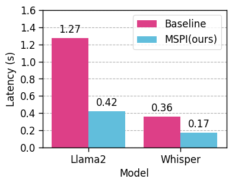
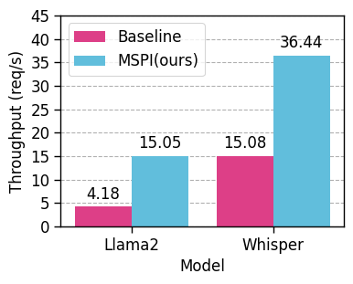
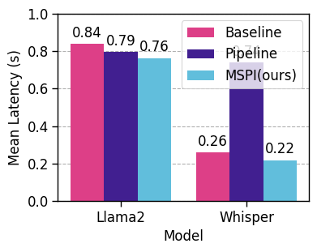
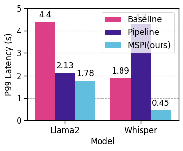
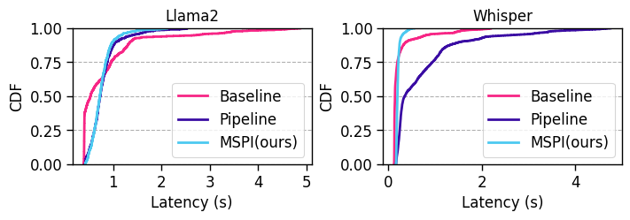

# mspi
MSPI：Multi-Source Pipeline Inference in Edge Cloud Collaboration

## Evaluation

<!-- the result of evaluation -->
The evaluation is based on stress tests from the hey tool and replays of real workload traces from Microsoft Azure Function (MAF).

### hey

<!-- show diagram -->

### MAF

